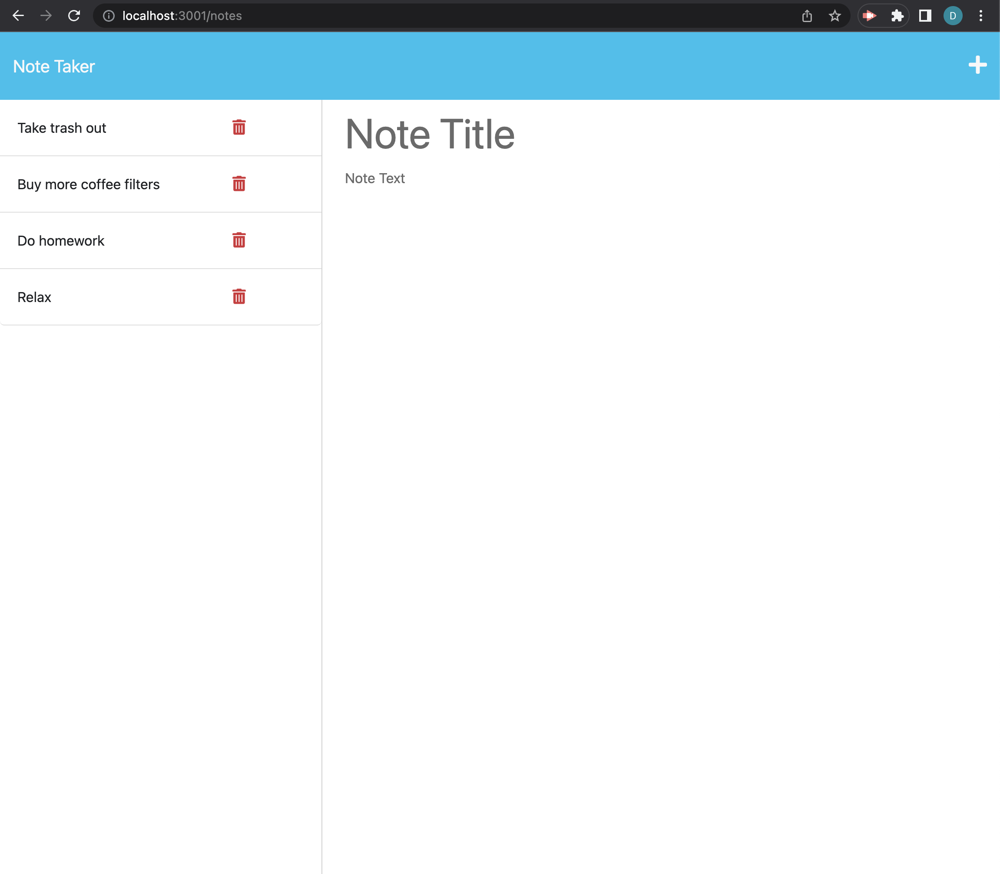

# Note Taker

  

  ## Desciption
  Note Taker is a web app that allows users to store notes so they can easily be accessed later! Notes are saved in a database so that the the user can always see the notes they have saved.

  ## Table of Contents
  * [Installation](#installation)
  * [Usage](#usage)
  * [Contriuting](contributing)
  * [License](#license)
  * [Support](support)
  
  ## Installation
  To run Note Taker, visit the online site.

  ## Usage
  The app has 2 input areas - 1 for a note title, and 1 for the note text. Both are required. Upon hitting the save button, the note is stored and can be seen on the left panel. You may click on an existing note to see the text you stored. To add a new note while viewing an existing note, click the '+' at the top right corner. Notes can be deleted.

  

  ## Contributing
  This app was made using express.js and deployed via Heroku.

  ## License
  This app is covered under the MIT license: [MIT](https://opensource.org/licenses/MIT)

  ## Support
  If you encounter problems with this README generator, please reach out to me on GitHub at: https://github.com/djbartolini, or email me at dan.barto@gmail.com
